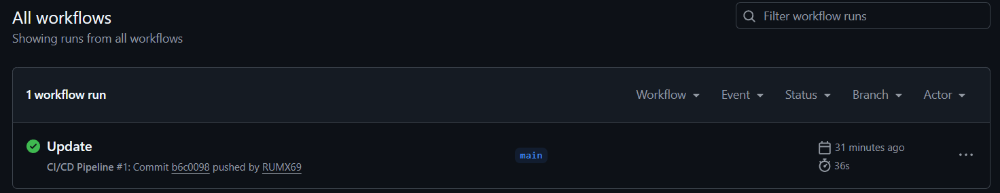

## CI/CD Pipeline – DSO101 Assignment 2
### How I configured the pipeline
Created a Jenkinsfile with 4 stages: Checkout, Install Dependencies, 
Build, and Test. Jenkins pulls code from GitHub using a Personal Access 
Token and runs 4 Jest unit tests automatically.

### Challenges faced
- Jenkins runs on Windows so had to use `bat` instead of `sh` commands
- Jenkinsfile had to be placed in the todo-app subfolder and Script Path 
  updated accordingly in Jenkins configuration

### GitHub Repo
https://github.com/RUMX69/YoselRai_02250381_DSO101_A1

## CI/CD Pipeline – DSO101 Assignment 2

### How I configured the pipeline
I created a Jenkinsfile with 4 stages: Checkout, Install Dependencies, 
Build, and Test. Jenkins pulls the code from GitHub using a Personal 
Access Token (PAT), installs npm packages, runs a build step, and 
executes 4 Jest unit tests automatically on every build.

### Challenges faced
- Jenkins runs on Windows, so had to replace all `sh` commands with 
  `bat` commands in the Jenkinsfile
- Jenkinsfile was inside the todo-app subfolder so had to update the 
  Script Path in Jenkins configuration to `todo-app/Jenkinsfile`
- Docker Pipeline plugin had missing dependencies so removed the Docker 
  stage from Jenkins and pushed the image manually instead

### GitHub Repo
https://github.com/RUMX69/YoselRai_02250381_DSO101_A1

### Docker Hub Images
- https://hub.docker.com/r/yoselrai/be-todo
- https://hub.docker.com/r/yoselrai/fe-todo

# YoselRai_02250381_DSO101_A1
https://github.com/RUMX69/YoselRai_02250381_DSO101_A1.git


# Assignment3

## GitHub Repository

🔗 https://github.com/RUMX69/YoselRai_02250381_DSO101_A1

## Live Deployment

🌐https://yoselrai-02250381-dso101-a3-fe.onrender.com

---

## Project Overview

A full-stack To-Do List web application containerised with Docker and deployed automatically using GitHub Actions CI/CD pipeline.

| Layer | Technology |
|---|---|
| Frontend | HTML + Nginx (Docker) |
| Backend | Node.js + Express.js |
| Containerisation | Docker + Docker Hub |
| CI/CD | GitHub Actions |
| Deployment | Render.com |

---

## Step 0 – Application Setup

### Repository Structure

```
YoselRai_02250381_DSO101_A1/
├── .github/
│   └── workflows/
│       └── ci-cd.yml          # GitHub Actions pipeline
├── todo-app/
│   ├── backend/
│   │   ├── app.js             # Express app (exported for testing)
│   │   ├── server.js          # Entry point
│   │   ├── server.test.js     # Jest unit tests
│   │   ├── package.json
│   │   ├── Dockerfile
│   │   └── .gitignore         # Excludes .env
│   ├── frontend/
│   │   ├── index.html
│   │   └── Dockerfile
│   └── render.yaml
└── README.md
```

### Environment Variables

Backend `.env` (not committed to Git):
```
PORT=5000
```

Frontend `.env.production` (not committed to Git):
```
REACT_APP_API_URL=https://be-todo.onrender.com
```

> `.env` is listed in `.gitignore` and was never committed to the repository.

---

## Part A – Docker Hub Deployment

### Steps Taken

**1. Created Dockerfiles**

Backend `todo-app/backend/Dockerfile`:
```dockerfile
FROM node:18-alpine
WORKDIR /app
COPY package*.json ./
RUN npm install
COPY . .
EXPOSE 5000
CMD ["node", "server.js"]
```

Frontend `todo-app/frontend/Dockerfile`:
```dockerfile
FROM nginx:alpine
COPY index.html /usr/share/nginx/html/index.html
EXPOSE 80
CMD ["nginx", "-g", "daemon off;"]
```

**2. Built and pushed images to Docker Hub**

```bash
# Backend
docker build -t yoselrai/be-todo:02250381 ./todo-app/backend
docker push yoselrai/be-todo:02250381

# Frontend
docker build -t yoselrai/fe-todo:02250381 ./todo-app/frontend
docker push yoselrai/fe-todo:02250381
```

> Student ID `02250381` used as the image tag as required by the assignment.

**3. Deployed on Render.com**

- Backend Web Service → Existing Docker Hub image → `yoselrai/be-todo:02250381`
- Frontend Web Service → Existing Docker Hub image → `yoselrai/fe-todo:02250381`

### Docker Hub Images

- 🐳 Backend: https://hub.docker.com/r/yoselrai/be-todo
- 🐳 Frontend: https://hub.docker.com/r/yoselrai/fe-todo

---

## Part B – Automated Build and Deployment (GitHub Actions)

### Steps Taken

**1. Created the GitHub Actions workflow** at `.github/workflows/ci-cd.yml`

**2. Added GitHub repository secrets:**

| Secret | Purpose |
|---|---|
| `DOCKERHUB_USERNAME` | Docker Hub account username |
| `DOCKERHUB_TOKEN` | Docker Hub access token (Read, Write, Delete) |
| `RENDER_DEPLOY_HOOK_BE` | Render webhook URL to trigger backend redeploy |
| `RENDER_DEPLOY_HOOK_FE` | Render webhook URL to trigger frontend redeploy |

**3. Pushed to `main` branch** — pipeline triggered automatically.

### How the Pipeline Works

Every `git push` to `main` triggers this automated flow:

```
git push to main
       ↓
GitHub Actions triggers ci-cd.yml
       ↓
Job 1: Install → Build → Run Jest tests
       ↓ (only if tests pass)
Job 2: Login to Docker Hub
       ↓
Build backend image → Push to Docker Hub (tag: 02250381)
       ↓
Build frontend image → Push to Docker Hub (tag: 02250381)
       ↓
Trigger Render deploy hook → Render pulls new image → Redeploys
```

### GitHub Actions Workflow File

```yaml
name: CI/CD Pipeline

on:
  push:
    branches:
      - main

jobs:
  test:
    name: Install, Build & Test
    runs-on: ubuntu-latest
    steps:
      - name: Checkout code
        uses: actions/checkout@v4

      - name: Setup Node.js
        uses: actions/setup-node@v4
        with:
          node-version: '18'

      - name: Install dependencies
        working-directory: todo-app/backend
        run: npm install

      - name: Build
        working-directory: todo-app/backend
        run: npm run build

      - name: Run tests
        working-directory: todo-app/backend
        run: npm test

      - name: Upload test results
        if: always()
        uses: actions/upload-artifact@v4
        with:
          name: junit-results
          path: todo-app/backend/junit.xml

  docker:
    name: Build & Push Docker Images
    runs-on: ubuntu-latest
    needs: test
    steps:
      - name: Checkout code
        uses: actions/checkout@v4

      - name: Login to Docker Hub
        uses: docker/login-action@v3
        with:
          username: ${{ secrets.DOCKERHUB_USERNAME }}
          password: ${{ secrets.DOCKERHUB_TOKEN }}

      - name: Build and push backend image
        uses: docker/build-push-action@v5
        with:
          context: ./todo-app/backend
          push: true
          tags: ${{ secrets.DOCKERHUB_USERNAME }}/be-todo:02250381

      - name: Build and push frontend image
        uses: docker/build-push-action@v5
        with:
          context: ./todo-app/frontend
          push: true
          tags: ${{ secrets.DOCKERHUB_USERNAME }}/fe-todo:02250381

      - name: Trigger Render backend deploy
        run: curl -X POST ${{ secrets.RENDER_DEPLOY_HOOK_BE }}

      - name: Trigger Render frontend deploy
        run: curl -X POST ${{ secrets.RENDER_DEPLOY_HOOK_FE }}
```

### Test Results

4 Jest unit tests run automatically on every push:

| Test | Result |
|---|---|
| GET /tasks returns an array | ✅ Pass |
| POST /tasks creates a task | ✅ Pass |
| PUT /tasks/:id updates a task | ✅ Pass |
| DELETE /tasks/:id deletes a task | ✅ Pass |

### Screenshot – Successful GitHub Actions Workflow


---

## Challenges Faced

1. **Secrets added in wrong GitHub section** — Initially added `DOCKERHUB_USERNAME` and `DOCKERHUB_TOKEN` under *Environments* instead of *Actions* repository secrets. The pipeline kept failing with "Username and password required" until the secrets were added in the correct place under Settings → Secrets and variables → Actions.

2. **Secret name typo** — `DOCKERHUB_USERNAME` was saved as `DOCKERHUB_USERNAM` (missing the E), which caused the Docker login step to fail silently. Fixed by deleting and re-adding the secret with the correct name.

3. **Docker Hub token permissions** — Initially generated a Read-only token, which does not allow pushing images. Regenerated the token with Read, Write, Delete permissions.

4. **Render deploy hooks not yet configured** — The `curl` steps to trigger Render deploys failed with "no URL specified" because the Render deploy hook secrets had not been added to GitHub yet. Added the hook URLs from each Render service's Settings page.

---

## Learning Outcomes

- Understood how to write a multi-job GitHub Actions pipeline with job dependencies using `needs:`
- Learned how to securely store credentials as GitHub repository secrets and reference them in workflows
- Understood the difference between *repository secrets* and *environment secrets* in GitHub
- Gained hands-on experience building and pushing Docker images to Docker Hub from a CI pipeline
- Learned how Render deploy hooks allow external services (like GitHub Actions) to trigger a redeployment
- Understood the full automated flow from a `git push` all the way to a live redeployment on Render

---

## Links

| Resource | URL |
|---|---|
| GitHub Repository | https://github.com/RUMX69/YoselRai_02250381_DSO101_A1 |
| Live App (Render) | https://yoselrai-02250381-dso101-a3-fe.onrender.com |
| Docker Hub – Backend | https://hub.docker.com/r/yoselrai/be-todo |
| Docker Hub – Frontend | https://hub.docker.com/r/yoselrai/fe-todo |
